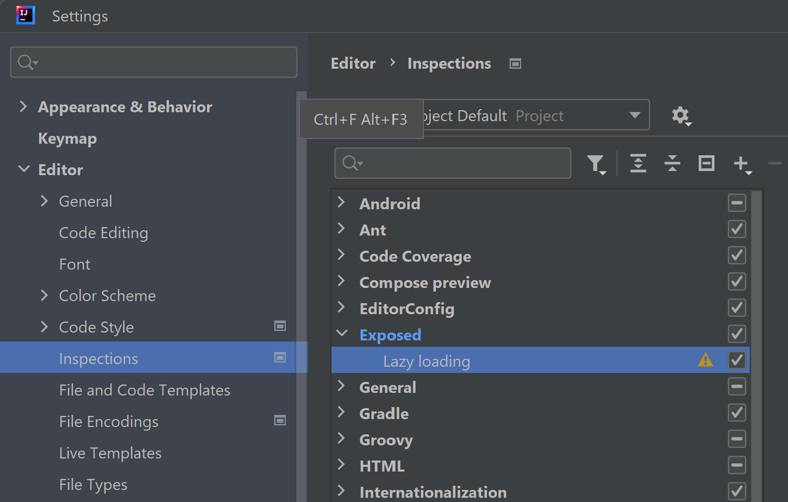
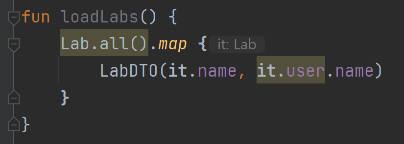
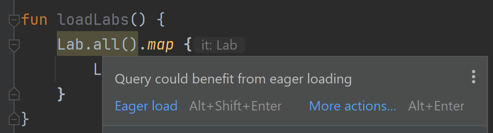

# Lazy Coach

Lazy Coach is an IntelliJ plugin that provides a code inspection to
detect lazy loading with the Exposed SQL Library for Kotlin.
Lazy loading can cause performance issues (the n+1 query problem),
causing some developers to avoid lazy loading in production. Having a code 
inspection promotes consistent adherence to this practice.

**Current status:** This is a pre-alpha proof of concept.

## Installation

1. Download the latest [release](https://github.com/paj28/lazy-coach/releases)
2. Within *Settings &rarr; Plugins* choose *Install Plugin from Disk*

3. Within *Settings &rarr; Editor &rarr; Inspections*, enable *Exposed &rarr; Lazy Loading*


## Usage

Consider the code below, which is a common pattern:

```kotlin
object Users: IntIdTable() {
    val name = varchar("name", 255)
}

class User(id: EntityID<Int>): IntEntity(id) {
    companion object: IntEntityClass<User>(Users)
    val name by Users.name
}

object Labs: IntIdTable() {
    val name = varchar("name", 255)
    val user = reference("foo", Users)
}

class Lab(id: EntityID<Int>): IntEntity(id) {
    companion object: IntEntityClass<Lab>(Labs)
    val name by Labs.name
    val user by User referencedOn Labs.user
}

data class LabDTO(
    val name: String,
)

fun loadLabs() {
    Lab.all().map {
        LabDTO(it.name)
    }
}
```

If we were to modify the DTO to also include the username, a
natural set of changes would be:

```kotlin
data class LabDTO(
    val name: String,
    val user: String,
)

fun loadLabs() {
    Lab.all().map {
        LabDTO(it.name, it.user.name)
    }
}
```

This makes use of lazy loading on the `lab.name` relationship.
Unfortunately, doing so causes a performance issue, because a
query is issued for each iteration of the loop. This is
the n+1 query problem.

If we now enable Lazy Coach, we get a warning for the lazy load:



The warning on the query provides a quick fix:



Applying the fix results in the following code change:

```kotlin
fun loadLabs() {
    Lab.all().with(Lab::user).map {
        LabDTO(it.name, it.user.name)
    }
}
```